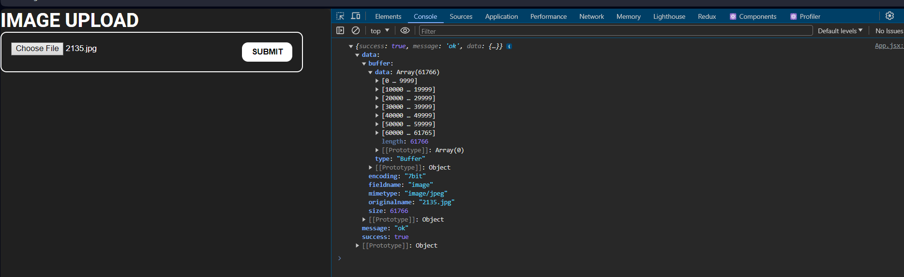

# UPLOADING IMAGES TO CLOUDINARY USING MULTER AND EXPRESS

<div align="center">

</div>

## ⭐ Cloudinary

```
npm i cloudinary
```

Cloudinary is an end-to-end image management solution for your website and mobile apps. Cloudinary covers everything from image uploads, storage, manipulations, optimizations to delivery.

You can easily upload images to the cloud, automatically perform smart image manipulations without installing any complex software. All your images are then seamlessly delivered through a fast CDN, optimized and using industry best practices.

### 💻 cloudinary configuration

> /config/cloudinary.js

```js
import { config, uploader } from "cloudinary";

const cloudinaryConfig = () =>
  config({
    cloud_name: process.env.CLOUD_NAME,
    api_key: process.env.CLOUDINARY_API_KEY,
    api_secret: process.env.CLOUDINARY_API_SECRET,
  });

export { cloudinaryConfig, uploader };

```

---

## ⭐ MULTER 

```
npm i multer
```

Multer is a node.js middleware for handling `multipart/form-data`, which is primarily used for uploading files. It is written on top of busboy for maximum efficiency.

###  ⚡ Why Is Needed?

Out of the box, NodeJS doesn’t know how to process any data, for example, we wanted our application to process JSON requests, we had to `body-parse`, in this case, `multer` makes it possible for an application to accept form-data which allows us to easily transport files from the browser to our server.

Without `multer`, when you’re sending a files to your server, the request body object`req.body` will be empty. Multer allows the data you’re sending from a form to be available and it also creates a `req.file` object which gives us access to the file buffer we’ve just uploaded from the client-side.

Now let’s configure Multer as a middleware that we can use with any route that needs to upload an image. On the middleware folder, create a multer.js file with the following configuration.

> /config/multer.js

```js
import multer from "multer";

const storage = multer.diskStorage();

const multerUploads = multer({ storage }).single("image");

export { multerUploads };
```

Notice that we’re making use of memory storage instead first writing the file to an `upload/` directory, this is because when we deploy our application to Heroku, we may not have the adminitrative privileges to write files to the remote computer which may crash our entire application.

`multer.memoryStorage()` tells multer that we’ll save the file to memory first which can be manipulated to the suit any purpose.

`multer({ storage }).single('image')`; sets the storage option we’ll be using on the application 

while the `.single('image')`; specifies the field name multer should go to when it’s looking for the file.

---

Import multerUploads on your `server/index.js` and add the following block of code to your `server/index.js` file

---

### 💻 Frontend configuration

```jsx
import { useState } from "react";
import "./index.scss";
import axios from "axios";

const App = () => {
  const [file, setFile] = useState(null);
  const [image, setImage] = useState({
    url: "",
    status: "nothing",
  });

  const handleSubmit = async () => {
    const formData = new FormData();
    formData.append("image", file);
    try {
      const response = await axios.post(
        "http://localhost:8080/api/upload",
        formData,
        {
          "Content-type": "multipart/form-data",
        }
      );
      console.log(response.data);
      setImage({
        ...image,
        url: response.data.data.image,
      });
    } catch (e) {
      console.log(e);
    }
  };
  return (
    <div className="app">
      <h1>IMAGE UPLOAD</h1>
      <div className="app-main">
        <input type="file" onChange={(e) => setFile(e.target.files[0])} />
        <button onClick={handleSubmit}>SUBMIT</button>
        
      </div>
    </div>
  );
};

export default App;
```



But I want to you to notice that the file is coming as buffer because we’re pushing it to memory before we can upload it to Cloudinary, which pose an issue for us since the Cloudinary `uploader` is either expecting a file path or a `string` but we’re receiving a buffer from `multer`.

So let’s convert the buffer to the format that the Cloudinary `uploader` will understand, we’re going to use the `datauri` package.

---

## ⭐ Data URI

A data URI is a base64 encoded string that represents a file. Getting the contents of a file as a string means that you can directly embed the data within your HTML or CSS code. When the browser encounters a data URI in your code, it’s able to decode the data and construct the original file. 

A Data URI (Uniform Resource Identifier) scheme allows you to include data inline within a web page as if they were external resources, like images or stylesheets. This technique is particularly useful for embedding small files directly within HTML or CSS to reduce the number of HTTP requests, which can improve page load times.

> [!NOTE]
> it’s able to decode the data and construct the original file.

You can use data URIs for all sorts of different file types, but they’re most commonly used on the web for images (and sometimes fonts).

A data URI follows a certain scheme (as shown below) that includes some information about the encoded file — such as the mime type — along with the encoded data itself.

```
data:[<MIME-type>][;charset=<encoding>][;base64],<data>
```

You can use a data URI within your HTML or CSS code wherever you would have placed a file path before. For example you could use a data URI to specify a background image in CSS:

```css
li { 
    background: url(data:image/png;base64,iVBORw0KGgoAAAANSUhEUgAAAEAAAABFCAYAAAD6pOBtAAAABmJLR0QA/wD/AP+gvaeTAAAACXBIWXMAAAsTAAALEwEAmpwYAAAAB3RJTUUH3gMbBwwfAKopzQAAEfdJREFUeNrVW3uUHFWZ...) no-repeat;
}
```

### ⚡ Components:

* **mediatype**: Specifies the type of data (e.g., `image/png`, `text/html`). If omitted, it defaults to text/plain.

* **charset**: Specifies the character set (e.g., `charset=UTF-8`).

* **base64**: Indicates that the data is base64 encoded. If not present, the data is assumed to be `URL-encoded`.

* **data**: The actual data, either base64 encoded or `URL-encoded`.

```html

```

---

```
npm i datauri
```

> /config/multer.js

```js
import multer from "multer";
import path from "path";
import DatauriParser from "datauri/parser.js";

const storage = multer.memoryStorage();
const multerUploads = multer({ storage }).single("image");
const parser = new DatauriParser();

const dataUri = (req) =>
  parser.format(
    path.extname(req.file.originalname).toString(),
    req.file.buffer
  );

export { multerUploads, dataUri };
```

### ⚡ `dataUri` Function:

* This function takes an HTTP request (req) as an argument.

* `path.extname(req.file.originalname).toString()`: Extracts the file extension from the original file name of the uploaded file and converts it to a string.

* `req.file.buffer`: The file data stored in memory as a Buffer object.

* `parser.format`: Converts the file data and its extension to a Data URI format.

> [!NOTE] 
> On the `dataUri` function above, we pass the request object and format the buffer and return a string blob.

---

> config/cloudinary.js

```js
import { config, uploader } from "cloudinary";

const cloudinaryConfig = (req, res, next) => {
  config({
    cloud_name: process.env.CLOUD_NAME,
    api_key: process.env.CLOUDINARY_API_KEY,
    api_secret: process.env.CLOUDINARY_API_SECRET,
  });

  next();
};

export { cloudinaryConfig, uploader };
```

> index.js

```js
import express from "express";
import dotenv from "dotenv";
import connectDB from "./config/mongoose.js";
import cors from "cors";
import { cloudinaryConfig, uploader } from "./config/cloudinary.js";
import { multerUploads, dataUri } from "./config/multer.js";

dotenv.config();
const app = express();
connectDB();
app.use(cors());

app.use(express.json());

app.listen(process.env.PORT, () => {
  console.log("SERVER LISTENING TO PORT: ", process.env.PORT);
});

app.post("/api/upload", multerUploads, cloudinaryConfig, (req, res) => {
  console.log(req.body);
  console.log(req.file);
  try {
    if (req.file) {
      const file = dataUri(req).content;
      return uploader.upload(file).then((result) => {
        const image = result.url;
        return res.status(200).json({
          success: true,
          message: "Image upload succcessfull",
          data: { image },
        });
      });
    } else {
      console.log("no files were found");
    }
  } catch (e) {
    console.log(e);
    res.json({
      success: false,
      message: "Image not uploaded",
    });
  }
});
```